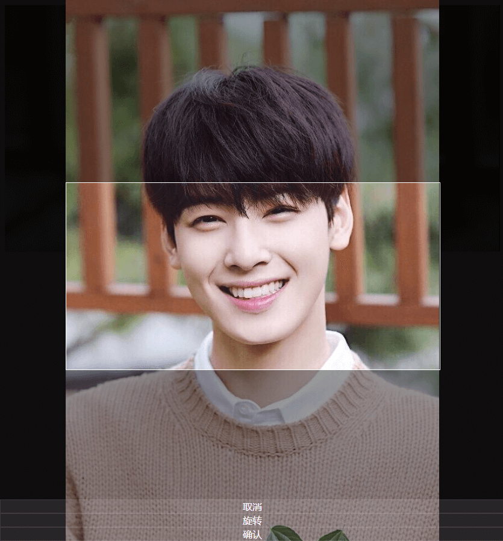

# vue-image-crop
基于Vue的移动端图片裁剪&上传组件



### 安装依赖
```
npm install
```

### 构建
```
npm run build
```
build之后会重新生成lib文件夹

### 查看示例
`npm i -g live-server`

`cd lib`

`live-server`

启用静态服务器打开`demo.html`试试吧
